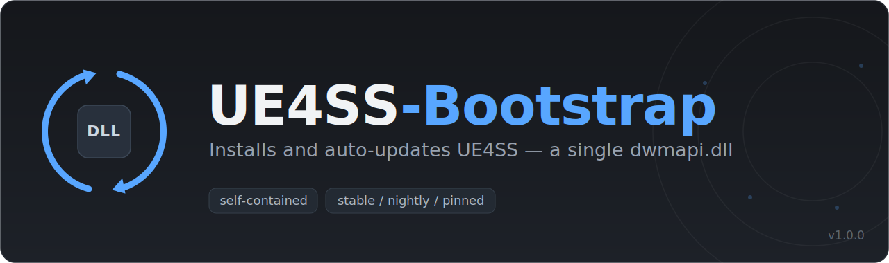

<p align="center">
  
</p>

# UE4SS-Bootstrap (dwmapi.dll)

A `dwmapi.dll` proxy that installs UE4SS from scratch and keeps it updated before
the game loads it. It is a clone of the [RE-UE4SS](https://github.com/UE4SS-RE/RE-UE4SS) proxy (same 143 exports, forwarding,
`--disable-ue4ss` / `--ue4ss-path` / `override.txt`) plus an in-DLL installer/updater.

## Install

```
<Game>\Binaries\Win64\dwmapi.dll            this proxy
<Game>\Binaries\Win64\ue4ss\updater.ini     config
```

Launch the game; UE4SS is downloaded and installed/updated automatically.

## How it works

On `DLL_PROCESS_ATTACH`:

1. Load `System32\dwmapi.dll` and wire up the 143 export forwarders.
2. Honour `--disable-ue4ss` (forward only).
3. On a worker thread: read `ue4ss\updater.ini`, resolve the target release on
   GitHub, and if needed download the `UE4SS_*.zip` asset, extract the selected
   components into `ue4ss\`, then load `UE4SS.dll`. Failures are logged to
   `ue4ss\updater.log`; the game still launches with the installed UE4SS.

## Config (`ue4ss\updater.ini`)

- `channel` — `stable` / `nightly` / `pinned` (+ `pinned_tag`).
- `[modules]` — allow-list of components to install; also synced to `Mods\mods.txt`
  enable flags. A mod not listed is not installed.
- `overwrite_settings` / `overwrite_mods_txt` — overwrite existing config files
  (otherwise written only when missing).
- `download_retries` — retry count for stalled/dropped downloads (with resume).
- `check_interval_days` — `0` checks every launch, `N` at most once per N days.
- `enabled = false` — disable the updater (pure proxy).

## Build

Requires Visual Studio 2022 (MSVC + MASM).

```
build.bat            full build  -> dist\dwmapi.dll
build.bat skeleton   proxy only (no updater)
```

Build artifacts go to `%TEMP%\UE4SS-Bootstrap-build`; the DLL is copied to
`dist\dwmapi.dll` and the default config to `dist\ue4ss\updater.ini`.

## Layout

```
src\dllmain.cpp          proxy + updater entry
src\proxy_exports.*       export table / jump stubs (generated)
src\proxy_generated.inc   mProcs[] + setup_functions() (generated)
src\updater.*             config, GitHub API, download, extract, versioning
src\progress.*            progress window
src\ini.hpp               INI reader / writer
src\miniz.*               vendored zip library (public domain)
tools\gen_proxy.py        regenerates the export files from dwmapi.exports
config\updater.ini        default config (shipped to dist\ue4ss\)
```
